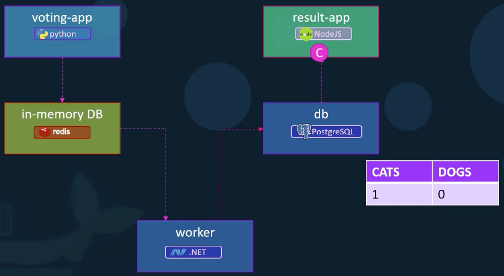

# Microservices application for Voting with Kubernetes

This is a small example application that shows how to use Kubernetes to deploy a microservices application.

This application was based on: 

- Docker example: https://github.com/dockersamples/example-voting-app
- Udemy course I did from `Mumshad Mannambeth`: https://oat.udemy.com/course/learn-kubernetes/

Basically here we see two ways of deploying: with `PODs` only or with `Deployments`. 
The `Deployment` allows us to set the number of replicas.

## Requirements

- Install [Minikube](https://kubernetes.io/docs/setup/learning-environment/minikube/).



## Create without deployment

```shell script
kubectl create -f voting-app-pod.yaml
kubectl create -f voting-app-service.yaml

kubectl create -f redis-pod.yaml
kubectl create -f redis-service.yaml

kubectl create -f postgres-pod.yaml
kubectl create -f postgres-service.yaml

kubectl create -f worker-app-pod.yaml

kubectl create -f result-app-pod.yaml
kubectl create -f result-app-service.yaml
```

## Create with deployment

```shell script
kubectl create -f voting-app-deployment.yaml
kubectl create -f voting-app-service.yaml

kubectl create -f redis-deployment.yaml
kubectl create -f redis-service.yaml

kubectl create -f postgres-deployment.yaml
kubectl create -f postgres-service.yaml

kubectl create -f worker-app-deployment.yaml

kubectl create -f result-app-deployment.yaml
kubectl create -f result-app-service.yaml
```

## Checking status

You can get the services IPs for accessing through the browser by typing (change the service as you wish):

```shell script
$ microservices % minikube service voting-service --url
```

### To vote

```shell script
$ minikube service voting-service --url 
http://192.168.99.100:30004
```

### To get the results

```shell script
$ minikube service result-service --url
http://192.168.99.100:30005
```